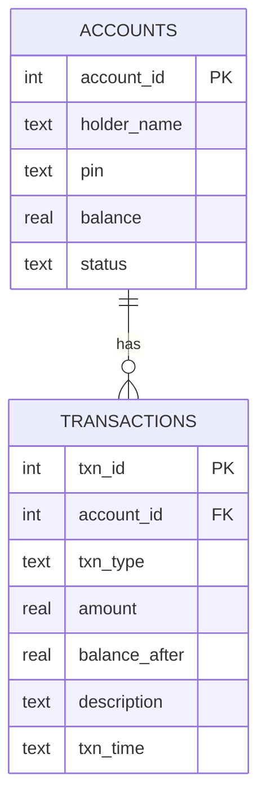

About

This project is the SQL counterpart of a console-based Java **ATM Simulator** (`AtmSimulator.java`). Where the Java program keeps the balance in a variable and the history in an `ArrayList`, this script stores them in real tables and lets the database enforce the same rules.

| Java Menu Option | SQL Equivalent |
|---|---|
| 1. Check Balance | `SELECT` on the `accounts` table |
| 2. Deposit Money | `INSERT` into `transactions` with type `DEPOSIT` |
| 3. Withdraw Money | `INSERT` into `transactions` with type `WITHDRAW` |
| 4. View Statement | The `mini_statement` view |
| 5. Exit | n/a (the database persists) |

---

Features

-  **Multi-user support** with a PIN and an account status (`ACTIVE`, `BLOCKED`, `CLOSED`)
-  **Automatic balance updates** through triggers
- **Built-in validation**, the same checks as the Java code:
  - Deposit or withdrawal must be greater than zero
  - Withdrawals cannot exceed the balance
  - Blocked or closed accounts cannot transact
  - The balance can never go negative
-  **Full transaction history** with balance after every transaction and a timestamp
-  **Edge-case users** pre-loaded to prove the rules work
- 🔁**Re-runnable script** that drops and recreates everything cleanly

---

Database Design



**Triggers**

| Trigger | When | What it does |
|---|---|---|
| `trg_txn_validate` | Before insert | Rejects invalid amounts, inactive accounts and insufficient balance |
| `trg_txn_apply` | After insert | Updates the balance (rounded to 2 decimals) and stores `balance_after` |

**View:** `mini_statement` joins accounts and transactions to give a ready-made statement (menu option 4).

---

Sample Users

| ID | User | Scenario it tests |
|---|---|---|
| 1 | Rahul Sharma | Normal user: starts with ₹1000, ends at exactly ₹0 |
| 2 | Zero Balance User | Account opened with ₹0 |
| 3 | Rich User | Very large balance (₹99,999,999.99) |
| 4 | Blocked User | Blocked after opening, so transactions are refused |
| 5 | No History User | Only the opening entry in the history |
| 6 | Decimal User | Paise-level amounts such as ₹0.25 |

---
Getting Started

**Online (quickest):** open [sqliteonline.com](https://sqliteonline.com) or OneCompiler (SQLite), paste `atm_simulator.sql` and click **Run**.

**Command line:**

```bash
sqlite3 atm.db < atm_simulator.sql
```

**DB Browser for SQLite:** `File → Open Database → Execute SQL → paste the script → Run`

---

## 🧾 Usage Examples

**Check balance**
```sql
SELECT holder_name, printf('₹%.2f', balance) AS current_balance
FROM accounts WHERE account_id = 1;
```

**Deposit ₹500**
```sql
INSERT INTO transactions (account_id, txn_type, amount, description)
VALUES (1, 'DEPOSIT', 500.00, 'Deposited: ₹500.0');
```

**Withdraw ₹200**
```sql
INSERT INTO transactions (account_id, txn_type, amount, description)
VALUES (1, 'WITHDRAW', 200.00, 'Withdrew: ₹200.0');
```

**View statement**
```sql
SELECT txn_time, txn_type, amount, balance_after
FROM mini_statement
WHERE account_id = 1
ORDER BY txn_id;
```

**Sample statement output (Rahul Sharma)**

| Type | Amount | Balance After |
|---|---|---|
| OPEN | 1000.00 | 1000.00 |
| DEPOSIT | 500.00 | 1500.00 |
| WITHDRAW | 200.00 | 1300.00 |
| WITHDRAW | 1300.00 | 0.00 |

---

Rules in Action

These statements are **rejected on purpose**:

| Attempt | Result |
|---|---|
| Withdraw more than the balance | `Transaction Declined: Insufficient balance!` |
| Deposit or withdraw `0` or a negative amount | `Invalid amount. Must be greater than zero.` |
| Transact on a blocked account | `Account is not active.` |
| Create an account with a PIN that is not 4 characters | `CHECK constraint failed` |
| Transact on a non-existent account | `FOREIGN KEY constraint failed` |

```sql
-- This will fail, as designed
INSERT INTO transactions (account_id, txn_type, amount)
VALUES (2, 'WITHDRAW', 99999);
```

---

Testing

Run on SQLite 3.45 with **zero errors**. All 7 invalid scenarios above were verified to be rejected with the right messages.

---

Project Structure

```
atm-simulator/
├── AtmSimulator.java     # Console ATM (Java)
├── atm_simulator.sql     # Schema, triggers, view and sample data
└── README.md             # You are here
```

---

Future Improvements

- 🔐 PIN verification and lockout after 3 wrong attempts
- 📅 Daily withdrawal limits
- 💸 Transfers between accounts
- 🔗 Connecting the Java app to this database through JDBC
- 🔑 Hashing PINs instead of storing plain text
